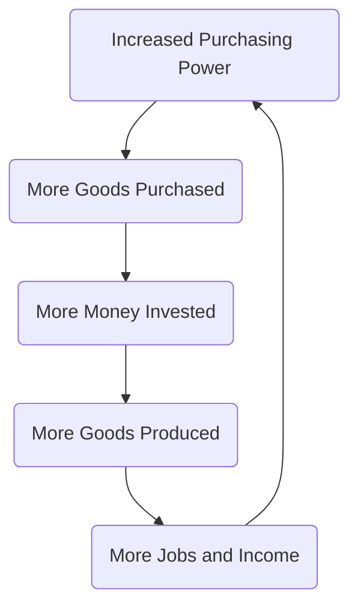
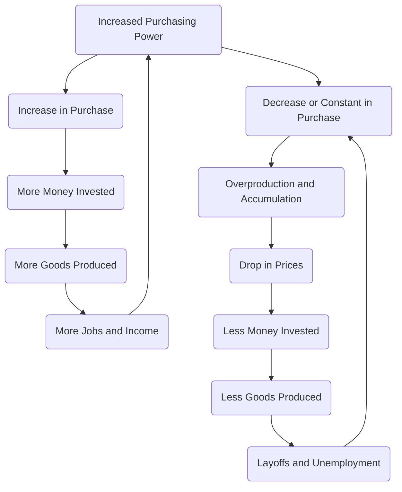

# More on Economic Cycles

#### Strength of Economy

Many factors determine the economic strength of a country. Currently, the most common way to measure the strength of a country's economy is the **GDP** (Gross Domestic Product) which is the market value of all goods and services produced in the region. Many other aspects can also reflect the strength of an economy, such as employment, imports, exports, amount of tax collected and purchasing power. 

#### Purchasing Power

One factor affecting the strength of economy is the purchase of goods. If large quantities of a product is purchased, then more people will invest in that product and more of that products will be produced, which leads to economic growth. 

The **purchasing power** of a population refers to the amount of goods and services that can be purchased with their income. Purchasing power is often linked to the amount of goods purchased and thus the growth or decline of economy. 

However, purchasing power does not directly determine the amount of goods purchased. The amount of goods that the consumers are willing to purchase also determines the amount of goods purchased, I will refer to that as **need** since I could not find a term in economy for it. 

When the purchasing power is greater than the need of a product, only the **needed amount** is purchased. For example, if I have a lot of purchasing power (income) and I can afford 30 cups of Starbucks every day. However, I do not have as much need since I only want to drink at most 6 cups of Starbucks and thus I will only purchase 6 cups of Starbucks every day because I only **want** that much. 

When the purchasing power is less than the need of a product, only the **affordable amount** is purchased. For example, I have a high need of Starbucks and I want to drink 12 cups of Starbucks per day. However, I do not have as much purchasing power since I can only afford 6 cups of Starbucks per day and thus I will only purchase 6 cups of Starbucks every day because I can only **afford** that much.

#### Credit and Interest

**Credit** is the amount of money that one party can borrow from another without paying back immediately. For example, people can use credit cards to borrow some money from a bank and return the money next month. Capitalists and cooperatives can also take loans from banks. 

**Interest** is the portion of the money that a party borrowed from another party, it is paid when returning the money. For example, if I borrow \$100 from a friend of mine with an interest rate of 5% per month. When I return the money after a month, I have to pay ​\$105 because I need to pay the interest. If I return the money after **two** months, I will have to pay $110 because I have to pay 5% interest for every month when the money is not returned. 

#### Stimulus

Governments can intervene in the economy to stimulate it, which means making the economy grow. Measures taken by the governments as attempts to stimulate the economy are called **stimulus**. 

Economy can be stimulated by **increasing purchasing power**. Increased purchasing power leads to more goods being purchased. Since more goods are bring purchased, more people will invest in industries that produce these goods, which leads to more goods being produced and the creation of job opportunities. For example, when people earned more money from work, they may spend on that money on more Starbucks. Capitalists noticed that Starbucks is very profitable, so they invest in Starbucks, which increased the production of coffee, opened more stores and created more jobs. More jobs then leads to increased purchasing power of the population. 

One simple way to increase purchasing power is to **encourage people to use their credit**. When people have access to more credit, people can spend more money, which means that they have more purchasing power. To encourage people to use their credit, the government can simply **reduce the interest rate** so that people feel less pressured to borrow money from banks. 

#### Backfire

Increasing purchasing power does not always leads to growth in economy. When the economy is in rapid growth on its own, stimulation of the economy can backfire.

It is mentioned earlier that increased purchasing power does not always lead to more goods being purchased. When the purchasing power is raised above the need for goods, the growth in purchase will **stop** since people no longer need to purchase more goods. 

When the amount of goods purchased remains the same or decreases, goods are still produced at a high rate, which leads to overproduction and accumulation. To sell these excess goods, the prices have to be lowered, which makes the business less profitable, which leads to less investments. To maintain the business, less goods are produced and workers are laid off, which decreases their purchasing power. Since decrease in purchasing power will lead to decrease in purchase when goods are not needed, less goods are purchased. 

For example, after Starbucks became popular, more and more people worked there and earned more money. However, they now earn more money than they will spend on Starbucks and they will stop spending more money on Starbucks. Starbucks though is still producing large quantities of coffee, overtime, the coffee starts to accumulate, and Starbucks is forced to decrease their price in order to sell the excess coffee. Capitalists noticed that Starbucks is no longer making as much profit, so they invested less money in it, which makes Starbucks close their shops and layoff workers as the cost to maintain them is too high. The unemployment leads to a decrease in purchasing power, which means that people can not afford as much Starbucks as they did before. 

And this is how increasing in purchasing power backfires. Does the right half of the graph look familiar? It should. It is how the [Great Depression](https://kaminingyou.github.io/history-notes/chapter2/5.html#delbig-saddel-great-depression) happened. 

To prevent issues like this to happen, the government must ensure that the purchasing power does not exceed the need too much. One way to decrease purchasing power is to **discourage people from using their credit**. When people have less credit, they can spend less money, which means that they have less purchasing power. To discourage people from using their credit, the government can simply increase the interest so that people feel pressured when borrowing money from banks.

#### Summary

The strength of a country's economy is determined by many factors. One of them is the **purchasing power**. Purchasing power is related to the purchase of goods, people will buy the goods that they **want** and can **afford**. Under economic slowdown, the government can stimulate the economy by **increasing the people's purchasing power**, which can be done by encouraging the use of credit. Raising the purchasing power too much will lead to economic recession, so governments keep the purchasing power under control by discouraging the use of credit under periods of economic growth. 