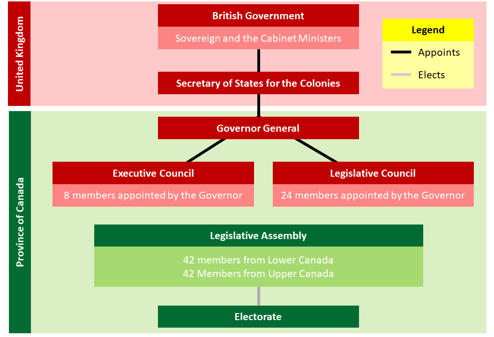

# The Act of Union

### Reason

* The Durham Report
  * Recommended
    * The Union of Upper and Lower Canada.
    * One government with one legislative assembly ([legislative union](#legislative-union)).
  * Goals
    * Create a British Canadian Majority (in population and in legislative assembly).
    * Assimilate the French Canadians.
* Economic Objectives
  * Combine the debts of Upper and Lower Canada.
    * Upper Canada was benefited because they had more debt.
  * Promote domestic trade.
    * To keep money in the colony and strengthen the economy.
  * Collection of custom duties at the ports.
    * Most of the ports were in Lower Canada.
* Advantages for Upper Canada.
  * Merged debt
  * Custom duties income
  * Domestic trade
  * British Canadian majority in the legislative assembly.

### Act of Union *(1840)*

* Territorial Change

  * Creation of the **Province of Canada** *(United Canada)*.
    * Replaced Lower and Upper Canada.

* Political Change

  * One single government with one single legislative assembly ([legislative union](#legislative-union)).
  * The Governor General kept all of his powers([veto](#veto)).
  * The Legislative Council kept all of its powers(approve or reject laws).
  * Control of the colony: **British Canadians**.
    * They control all levels of government.

* The political organisation of the Province of Canada *(1840)*

  

# Definitions

#### Legislative Union

The union of a number of territories under the authority of a single government.

#### Veto

The power to reject any bill proposed by the legislative assembly. (Final say on it.)