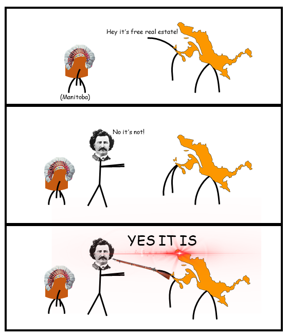

# Development of the Canadian Federation: Western Expansion

### Provinces in Canada and the Metis Uprising

* First four provinces (1867)
  * Ontario, Quebec, New Brunswick, Nova Scotia
* Territorial Expansion (1870-1873)
  * Manitoba, Northwest Territories (1870)
  * British Columbia (1871)
  * Prince Edward Island (1873)
* Metis people
  * Ancestry: half indigenous half French.
  * Subsistance activities: hunting (primary) and farming.
  * Worried that they will lose their land, culture and way of life.

### Metis Uprising: Red River Rebellion (1869)

* Federal government sends surveyors to the Red River Area.
  * Surveyors were asked to divide the land and have it ready for colonists to take over.
    * The presence of surveyors worried the metis.
* National Committee of Metis
  * Leader: Louis Riel (Born and educated in Montreal)
  * Objective: Protect their land and create a province for the Metis
  * Provincial (temporary) government created to negotiate entry into the Dominion.
  * Demands to the federal government
    * Province in the dominion.
    * Protect their land, culture and way of life.
* Execution of Thomas Scott (1870)
  * English colonists refused to listen to Riel's provisional government
  * Riel accused the English colonists for being insubordinates (not coorperative) and captured Thomas Scott.
  * Scott was executed by Riel in 1870.
  * Riel fled to the US.
  * Consequence: Manitoba Act (1870)
    * The province of Manitoba was created, more english people started to move in the Metis territory.
    * The federal government did not project the rights of the metis.
* Increase in English settlers.
  * Problems for the Metis.
    * Losing land rights.
    * Catholic schools were closing.
    * Forced to move to near areas.

### Second Uprising: North-west Rebellion (1885)

* Expansion of the railway caused problem for the Metis in the North-West.
  * The federal government wanted to extend the railway through the Metis territory in the Batoche region.
  * Riel formed a provisional government in Batoche and formed a rebel group to fight against the Canadian military.
* The federal government intervenes: sent troops to Batoche
  * Riel's rebels lost to the Canadian military.
  * Riel was captured and prisoned until his trail
    * Accused of treason
* Execution of Louis Riel
  * Seen as an attack on all francophones in Canada
  * Caused political tension between Quebec and Ottawa
    * The provincial government demanded more political automony.