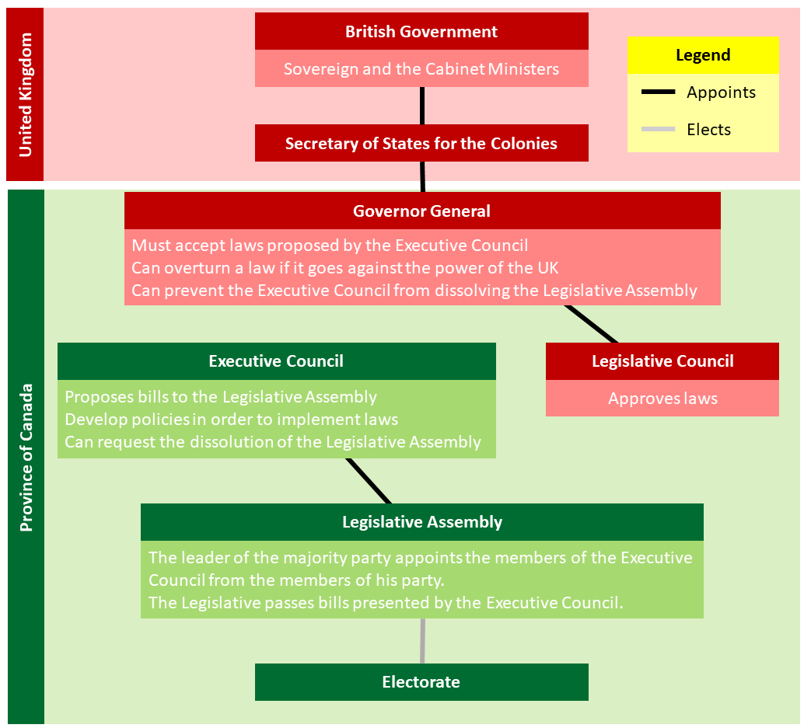
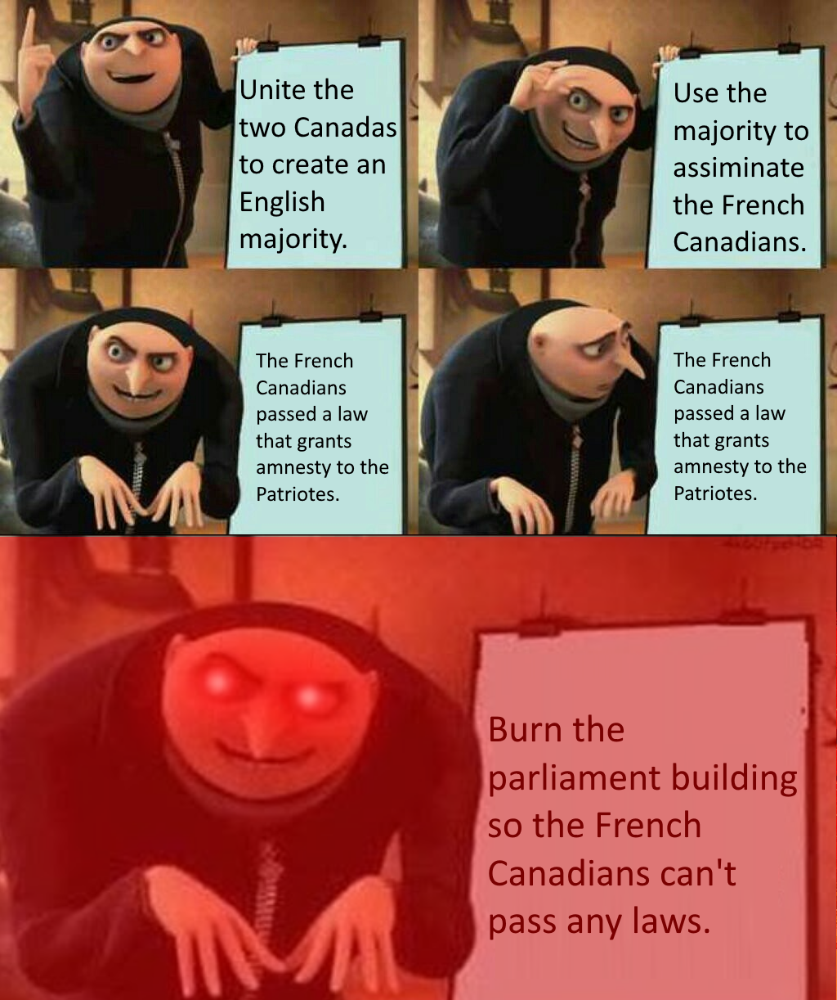

# Responsible Government

### Abolishment of [Protectionism](#protectionism)

* Economic consequences of protectionism
  * Economic growth in the Province of Canada
    * Because they had guaranteed trading partners provided by the UK.
    * They don't have to face foreign competition.
* Problem for the merchants in the UK
  * Limited option of products
    * They could get better quality products from somewhere else.
    * They could get the same product for a better price somewhere else.
* Protectionism abolished *(1846)*
  * New economic policy: [free trade](#free-trade).
  * Corn Laws abolished.
  * Navigation Acts *(foreign ships could not enter British ports)* abolished.
  * Consequences for the merchants in the Province of Canada
    * They lost guaranteed trading partners.
    * Increased competition. *(They had to face foreign competition.)*

### Establishing [Responsible Government](#responsible-government)

* Autonomy *(freedom)* for the Province of Canada
  * The UK cuts all economic ties with the Province of Canada when protectionism was abolished.
  * The UK was willing to let the colony take control of its internal affairs.
  * The Province of Canada gains economical and political autonomy.
* The Reformers gained a double majority in the Legislative Assembly *(1848)*
  * They founded the first responsible government.
  * Baldwin and Lafontaine formed the first executive council.
    * Members of the executive council are forced to resign if they lose the trust of the people and the Legislative Assembly.
* The functioning of responsible government *(1848)*
  

### Responsible Government

* Limitations
  * The Governor General still has veto power.
  * The Legislative Assembly can still be dissolved.
* Atonomy of the Province of Canada
  * Internal Affairs
    * The government of the Province of Canada controls its internal affairs.
  * External Affairs
    * The UK controls its external affairs.
* Defending French Canadian interests.
  * French was allowed in the Legislative Assembly (Due to the Alliance of the Reformers)
  * English remained to be the only official language.
* Laws to protect French Canadians
  * Granted [amnesty](#amnesty) to all *Patriote* members.
  * Granted finantial [compensation](#compensate) *(moneh)* to the victims of the rebellions. 
    * The victims were mostly French Canadians.
  * English Canadians were very upset and they burned the parliament building.
    

### First Nations in the Province of Canada

* Bagot Comission *(1842-44)*
  * Written by Governor Charles Bagot.
  * Recommendations on the management of Indigenous lands. ([reserves](#reserve))
* Reserves in Lower Canada
  * Used recommendations from Bagot Comission to divide land and created reserves for the First Nations.
  * The First Nations must live in their reserves.
* [Sedentarisation](#sedentarisation) of First Nations
  * Form of assimilation
  * Changed the way of life of many nomadic hunters.

# Definitions

#### Protectionism

Economic policy that protects the economy of a country from foreign competition. (British colonies and the UK could only trade with each other and the UK).

#### Free Trade

An economic system under which custom duties are abolished in order to promote trade with other countries.

#### Responsible Government

A government in which the members of the Executive Council are chosen from amoung the members of the majority party in the Legislative Assembly.

#### Amnesty

A measure that terminates legal proceedings and grants a pardon.

#### Compensate

To pay a sum of money in recognition of damages or injuries sustained.

#### Reserve

Territory set aside for First Nations and administered by the Canadian government.

#### Sedentarisation

The settling of a nomadic population.