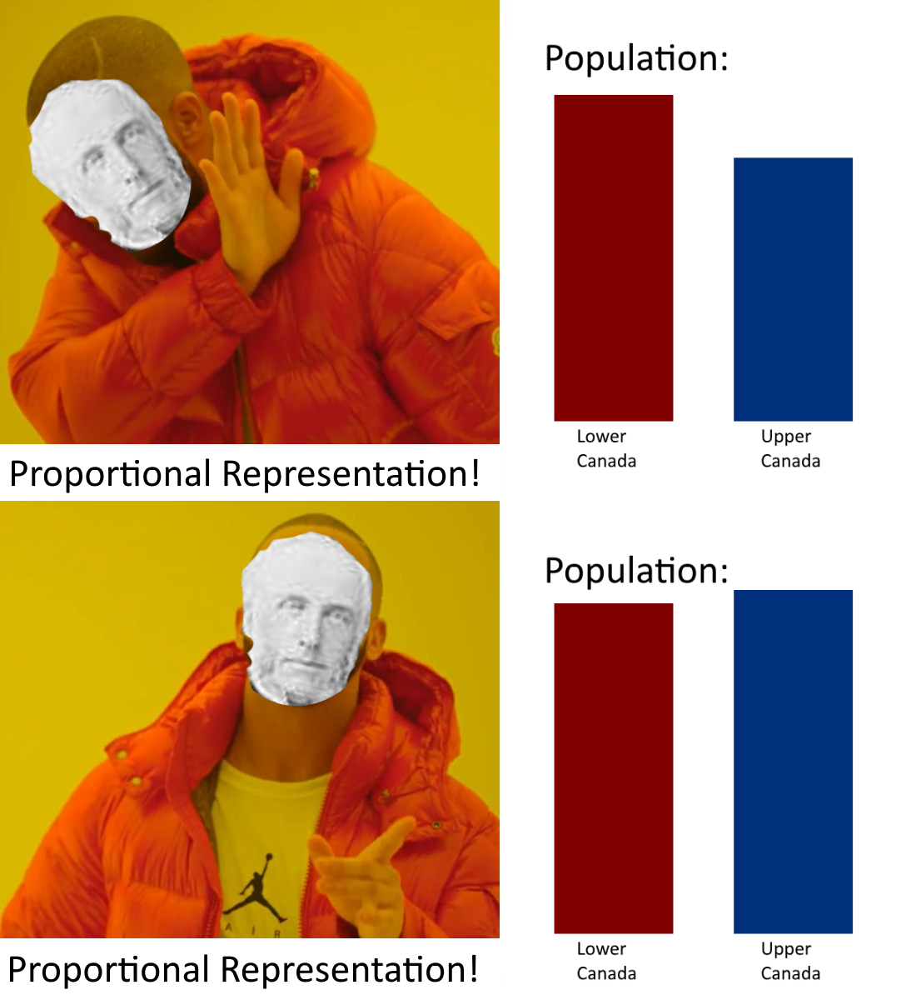

# Toward a Canadian Federation

### British North America in the 1850s

* Territory divided into three areas:
  * Province of Canada
  * Rupert's Land (owned by the Hudson's Bay Company)
  * Northwest Territories
* The Reformers controlled the Legislative Assembly until 1854
  * They lost the [double majority](#double-majority) in 1854.
    * It becomes difficult to pass bills.
  * The Reformers split up and joined one of the two new parties.
    * (The **Liberals** and the **Conservatives**)

### The [Two Party System](#two-party-system)

|                     | Liberals                                                     | Conservatives                                       |
| ------------------- | ------------------------------------------------------------ | --------------------------------------------------- |
| Composition         | Radical Reformers *(Change!)*                                | Moderate Reformers                                  |
| Lower Canada        | *Parti Rouge* Leader: **Dorion**                        | *Parti Bleu* Leader: **Cartier**               |
| Upper Canada        | *Clear Grits Party* Leader: **George Brown**            | *Conservative Party* Leader: **Macdonald**     |
| Currents of thought | **Dorion**: [Nationalism](#nationalism) and [Anticlericalism](#anticlericalism) | **Cartier**: [Ultramontanism](#ultramontanism) |

* Conservatives shared common goals.
  * Promote the development of the colony.
  * Promote domestic trades.
* Liberals did not agree with each other.
  * Shared goals
    * Catholic Church had too much power and they wanted them out of political affairs.
  * Brown did not work with Dorion.
    * Feared French domination (Dorion)
      * Difficult for the liberals to get a double majority.
      * Refused to work with Dorion most of the time.

### [Ministerial Instability](#ministerial-instability)

* Lacked a double majority *(1854-64)*
  * Conservatives had a majority in Lower Canada.
  * Clear Grits had a majority in Upper Canada.
  * Very difficult to pass any bills.
* [Minority Government](#minority-government) was formed.
  * Difficult to come to an agreement on any decisions.

### [Proportional Representation](#proportional-representation)

* Lower Canada had more population than Upper Canada *(1840-1850)*.
  * Legislative Assembly: Equal representation.
    * To limit the number of French Canadian representatives.
  * Upper Canada's population surpasses Lower Canada's population *(1851)*.
    * Brown proposed to swap to proportional representation.
    * Result
      * Lower Canada votes against this proposal.
      * Conservative in Upper Canada also vote against it.
        * To keep the alliance with *Parti Bleu*. 

# Definitions

#### Double Majority

A government that had the support of the majority of the members of the Legislative Assembly, in both Upper and Lower Canada.

#### Ministerial Instability

When no party have more than 50% of the elected members in the Legislative Assembly. 

#### Majority Government

A Government formed by the party that had more than 50% of elected members in the Legislative Assembly.

#### Minority Government

A government formed by a party that had less than 50% of the elected embers in the Legislative Assembly. It was able to govern through the support from members of other parties.

#### Two Party System

A political system in which two main parties succeed one another as the head of government.

#### Nationalism

A sense of belonging to a nation or a territory. Refers also to a political ideology in which a group of individuals who share common characteristics identify as a nation.

#### Anticlericalism

Belief that the church should not involve in affairs of state or public life in general.

#### Ultramontanism

A political and religious doctrine according to which the Catholic Church exercises control in all spheres, particularly with respect to political power.

#### Proportional Representation

A system in which the number of members elected to the Legislative Assembly had to be in proportion to the population of each region.