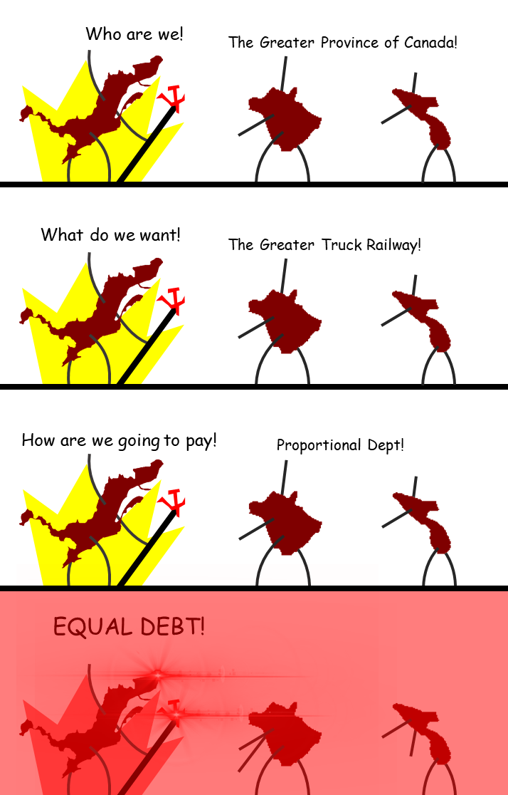

# Moving Towards Confederation

### The Great Coalition

* Brown wanted to end ministerial instability.

  * He chose to join Macdonald's Conservative Party to give them a double majority.

* The Great Coalition = Brown + Macdonald + Cartier.

* [Confederation](#confederation)

  * Larger domestic market (more moneh).
  * Better defence against the US.

### Charlottetown and Quebec Conferences

* Charlottetown *(September 1864)*

  * Maritime colonies had arranged a meeting to discuss a union.
    * The Province of Canada found out and invited themselves to the negotiations.
  * Proposed a federal union (of the maritime colonies and the Province of Canada).
  * Agreed on the principles of a federal union of the British North American colonies.
    * Newfoundland, New Brunswick, Prince Edward Island, Nova Scotia.

* Quebec City *(October 1864)*

  * **72 Resolutions**: Laws that will make up the confederation's constitution.
    * The division of powers between two levels of government (federal and provincial).
    * The proportional representation of the members of the legislative assemblies of each of the provinces.
      * The Province of Canada had more population than other colonies.
    * The construction of a railway linking all of the provinces in the federal union.
      * Facilitates trade and transportation between the colonies.

### Reactions to confederation

* Maritime Colonies
  * Debt concerns
    * The Province of Canada has a lot of debt.
    * They do not want to pay tax for the Province of Canada.
  * Proportional Representation
    * They would have less seats in the Legislative Assembly.
  * Withdrawals.
    * **Prince Edward Island** and **Newfoundland**. 
* New Brunswick elections controversy *(1865)*
  * The Prime Minister that was elected in 1865 did not support confederation.
  * The lieutenant governor removed him from power and put a pro-confederation leader in power *(1866)*.
* Nova Scotia
  * Agreed on the promise that a railway will be constructed to link Nova Scotia to the rest of the confederation.

* Province of Canada: Supportive

  * Political
    * They will have more seats in the Legislative Assembly than other provinces, which gives them control.
  * Territorial
    * More territory *(more moneh)*.
* Dorion: Against confederation
  * He thinks that the French Canadians will become more of a minority in the colony.

### London Conference *(1866)*

* Bill drafted based on the **72 Resolutions**.
  * New constitution: BNA Act.
* The Federal Government kept two powers.
  * [Residual power](#residual-power) and [power of disallowance](#power-of-disallowance).
* Wanted a confederation but implemented a federation.
  * The federal government holds more power in a federation than in a confederation.

# Definitions

#### Confederation

The association of several states that delegate some of their power to a central government while maintaining their political authority.

#### Residual Power

All powers not stipulated in the Constitution automatically fall to the federal government.

#### Power of Disallowance

The power to reject laws adopted by the provinces.