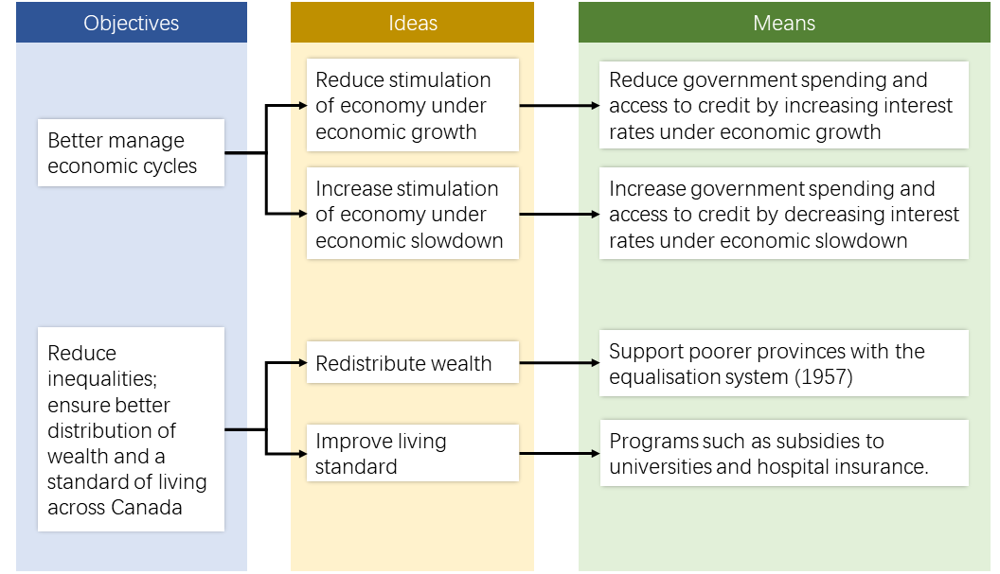
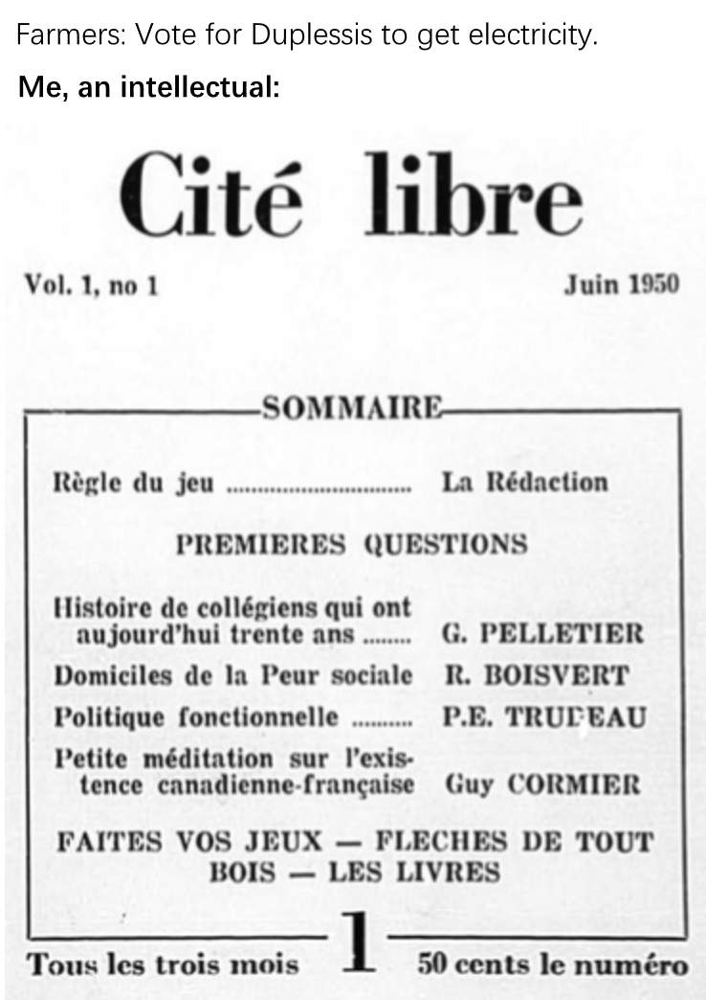

# Duplessis Government

### International Context

* **Cold War** (USA vs. USSR) *(1947-1991)*
  * War of competing ideologies (capitalism and communism).
    * The US supported capitalism, democracy and freedom of expression.
    * The USSR supported communism but was against democracy and freedom of expression.
  * Fought through [proxy wars](#proxy-war) and [arms race](#arms-race).
* Korean (Civil) War *(1950-1953)*
  * North Korea was a communist nation supported by China and the USSR.
  * South Korea was an *anti-communist* nation supported by the UN (which includes the US, the UK, Canada and other nations).
  * Both sides were given money, weapons and forces.

### Federal Economic Development Policies

* Post-war economy
  * Rebuilding of Europe was an opportunity to benefit Canada's economy.
    * Ottawa financed Canadian exports to Europe.
    * *General Agreement on Tariffs and Trade *(GATT)* *(1947)*
      * Signed with 22 other nations.
      * Promoted international trade.
* Cold War Arms Race
  * The US needed raw materials to support their military industry.
    * Increase in exports to the US (in raw materials).
    * Increase in exploitation of resources.
    * Inauguration of the St. Lawrence Seaway *(1959)*
      * Waterway that allowed transatlantic shapes to reach the Great Lakes (access to US ports).
      * Financed by the US and Canadian government
        * To improve transportation infrastructure and facilitate trade.

### Federal Intervention in Canadian Economy

* The federal government increased intervention in the economy after WWII.
  
* [More on Economic Cycles](../articles/economic_cycles.md)
* The federal government wanted to centralise economic decisions and intervene in provincial jurisdictions.
  * To obtain the tax revenue needed to implement these measures.
  * Refused by certain provinces such as Ontario and Quebec.
    * The federal government created programs for these measures.
    * Provinces that participate in the programs agreed to share tax revenue with the federal government and receive subsidies from them.

### Duplessis and Provincial Autonomy

* Duplessis re-elected *(1944-1960)*
  * Godbout and the liberal party failed to keep their promise of not imposing conscription.
  * Promised to defend provincial autonomy and the French Canadian identity.
    * Such as education and health care, which were controlled by the Catholic Church.
* Refusal of Federal Interventions
  * Refused to participate in programs related to equalisation.
    * Refused federal subsidies
    * Refused federal tax collection in Quebec
    * Increase in provincial tax collection
      * Provincial income tax *(1954)*

### Economic Development Policies of the Duplessis Government

* Focused on foreign investment and regional development
* [Economic Liberalism](../chapter2/2.md#economic-liberalism)
  * Lower fees and taxes
  * Attract US investments
  * Ensure that Quebec benefits from the US's need of raw materials
* Exploitation of natural resources
  * Mining resources attracted US businesses
    * Development of Cote-Nord and Nouveau-Quebec *(1945-1960)*
      * Exploitation of deposits (iron).
    * Mining towns (Schefferville and Gagnon)
      * Railways were built to ship ores.
  * US Capital stimulated mining production and boosted Quebec's revenue.
* Modernisation of Agriculture
  * Duplessis is supported by electoral districts in rural areas.
  * Duplessis adopted policies to modernise rural areas and farms.
    * To secure votes in his election
    * *Act to Promote Rural Electrification by Means of Electricity Cooperatives* *(1945)*
      * Farms with electricity produced more.
      * Stimulated economic development in the regions.
        

### Social Policies of the Duplessis Government

* Clericalism
  * The clergy and the Union Nationale shared the same values.
  * They have a mutually supportive relationship.
* Education
  * More religion than education
  * Poor school conditions
    
    * Insufficient funds invested in education
    * Outdated infrastructure *(1950s)*
      * 70% of schools had only one classroom.
      * 60% of schools were without electricity.
      * 40% of schools were without washrooms.
    * 50% of school boards were experiencing financial difficulties *(1956)*.
  * The level of schooling around francophones were lower than that of anglophones.
* Health Care
  * People had to pay for health care.
    * Only people who could afford health care had access to it.
  * Duplessis refused to establish a health insurance program.

### Protest Movements Against the Duplessis Government

* Union Opposition
  * Duplessis opposed unions because they disrupted social order.
  * Asbestos Strike *(1949)*
    * Miners in Thetford Mines and Asbestos went on strike.
    * Duplessis supported the employers.
      * The strike was declared illegal.
* Opposition by intellectuals and artists
  * *Refus Global*
    * [Manifesto](#manifesto) written by 15 young artists.
      * Including Jean-Paul Riopelle and Paul-Émilie Borduas.
    * Protest against the social conservatism of the Duplessis government and the Catholic Church.
    * Denounced the Catholic Church's control over Quebec society.
      * Held it responsible for Quebec's cultural lag.
  * *Cité Libre*
    
    * Magazine founded by Pierre Elliott Trudeau and Gérard Pelletier.
    * Promoted individual freedoms, democracy and freedom of expression.
    * Denounced the Duplessis government's social conservatism, nationalism, corruption and favouritism. 
  * Secularism
    * Advocated by artists and intellectuals who oppose Duplessis
    * Demands
      * State's control over education and health care
      * Reform of the education system to modernise Quebec's society.

### Change and Evolution of the Society

* Emergence of the consumer society.
  * Post WWII: 30 years of economic prosperity
    * Increased usage and purchasing power
    * Decreased working hours
    * More leisure time
  * Characteristics of a consumer society
    * People can afford most of the goods they needed
      * [Mass Consumption](#mass-consumption)
    * More accessible credit
    * Advertising became a popular means of encouraging consumers to buy products.
* Influence of American culture
  * Challenged the conservative values of the Catholic Church.
    * Valued freedom, material comfort, individualism and economic success.
  * Increased exposure to American culture from TV and movies.
* Population Growth
  * Sudden increase in birth rate *(1945-1960)*
    * Known as the baby boom.
  * Factors contributing to the rate of natural increase.
    * Decrease in mortality rate.
    * Decrease in infant mortality rate.
      * Due to better access to health care
        * Babies delivered to hospitals
        * Access to modern equipment.
  * Immigration
    * Rise in immigration *(1945)* (20000 - 30000/year)
    * *Immigration Act* *(1952)*
      * Favoured immigrants from Western Europe and the US.
        (Similar ethnicity to the Canadians).

### Indigenous Communities

* Failure of Residential Schools
  * They are costly and ineffective.
  * *Indian Act* amendment *(1951)*
    * First Nation children could attend the same schools as other Canadians.
* Residential schools in Quebec
  * New residential schools opened in 1950s and 1960s.
    * Amos, Point-Bleue (Mashteuiatsh), Sept-Iles and La Tuque.
  * Administrated by religious communities (Catholic Church)
  * Components of teaching programs
    * Academic training
      * Focused on religion
      * Poorly trained teachers recruited by religious communities.
    * Practical training (trade training)
      * Shoemaking and carpentry (male)
      * Domestic work and cooking (females)
      * Unpaid labour of students
  * The federal government ended its partnership with religious communities *(1969)*.
    * Residential schools became secular.
* Inuit Situation after 1945
  * Northern Inuit territory was of strategic importance during the Cold War
    * Hydroelectric and mining potential
    * Federal Intervention
      * Medical centres, housing and schools.
    * Provincial (Quebec) Intervention
      * Inuktitut school board (overrides federal schools) *(1960)*
        * Courses on traditional Inuit skills
        * Taught by Inuit teachers
        * Did not attract students
      * Inuits took control over the school boards *(1970s)*
* Resource exploitation
  * Accelerated resource exploitation in Cote-Nord and Nouveau Quebec.
  * Indigenous groups did not benefit from the exploitation of their territory.
    * Resource exploitation threatened hunting and trapping activities.
    * Construction of hydroelectric dams
      * Caused the flooding of indigenous territories.
    * Mining, infrastructure construction and arrival of workers
      * Disturbed the ecosystems of several territories (pollution).
* First Nation's right to vote
  * Indigenous men could vote if they renounce their Indian status.
    * And women after 1918 (Federal).
  * Right to vote without restrictions (federal) *(1960)*

### Moving Towards Change

* Death of Duplessis *(1959)*
* Paul Sauvé
  * Replaced Duplessis as premier.
  * Shifted away from Duplessis' policies.
  * Passed 66 laws in 4 months.
    
  * Died in 1960.

# Definitions

#### Proxy War

An armed conflict between two states that are indirectly supported by other nations.

#### Arms Race

Competition between two parties to have the best armed forces (weapons).

#### Manifesto

Published declaration of principles and intentions of an individual or group.

#### Mass Consumption

Economic phenomenon marked by a high level of consumption.